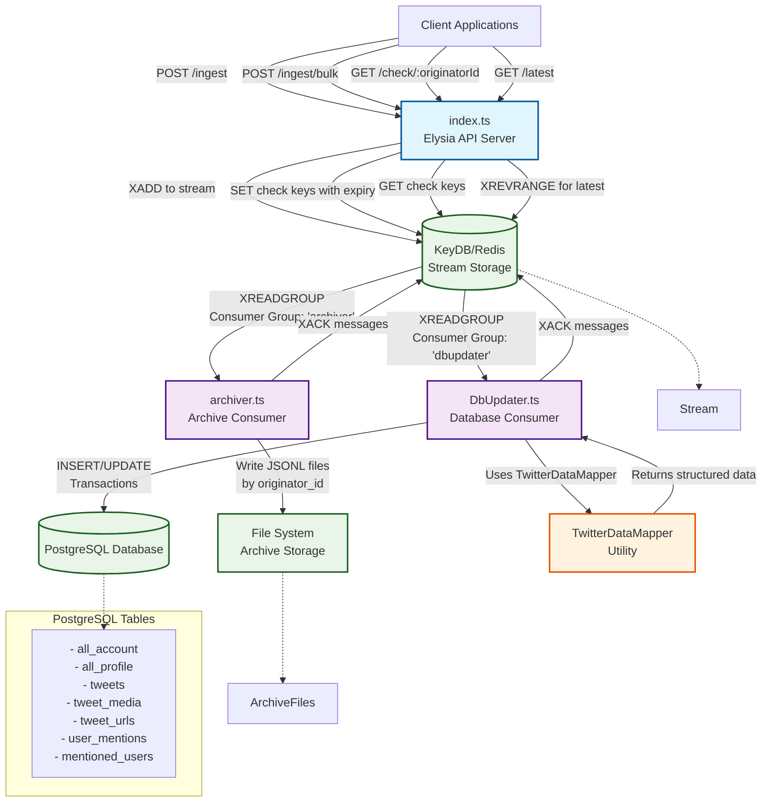

### Architecture

```mermaid
graph TB
    %% External Components
    Client[Client Applications]
    FileSystem[File System<br/>Archive Storage]
    PostgreSQL[(PostgreSQL Database)]
    
    %% Main Components
    API[index.ts<br/>Elysia API Server]
    KeyDB[(KeyDB/Redis<br/>Stream Storage)]
    Archiver[archiver.ts<br/>Archive Consumer]
    DbUpdater[DbUpdater.ts<br/>Database Consumer]
    
    %% Data Mapper Utility
    TwitterMapper[TwitterDataMapper<br/>Utility]
    
    %% Client interactions with API
    Client -->|POST /ingest| API
    Client -->|POST /ingest/bulk| API
    Client -->|GET /check/:originatorId| API
    Client -->|GET /latest| API
    
    %% API interactions with KeyDB
    API -->|XADD to stream| KeyDB
    API -->|SET check keys with expiry| KeyDB
    API -->|GET check keys| KeyDB
    API -->|XREVRANGE for latest| KeyDB
    
    %% Stream consumption
    KeyDB -->|XREADGROUP<br/>Consumer Group: 'archiver'| Archiver
    KeyDB -->|XREADGROUP<br/>Consumer Group: 'dbupdater'| DbUpdater
    
    %% Archiver processing
    Archiver -->|XACK messages| KeyDB
    Archiver -->|Write JSONL files<br/>by originator_id| FileSystem
    
    %% DbUpdater processing
    DbUpdater -->|XACK messages| KeyDB
    DbUpdater -->|Uses TwitterDataMapper| TwitterMapper
    TwitterMapper -->|Returns structured data| DbUpdater
    DbUpdater -->|INSERT/UPDATE<br/>Transactions| PostgreSQL
    

    
    %% Database tables
    subgraph "PostgreSQL Tables"
        Tables[- all_account<br/>- all_profile<br/>- tweets<br/>- tweet_media<br/>- tweet_urls<br/>- user_mentions<br/>- mentioned_users]
    end
    

    
    %% Connect subgraphs
    KeyDB -.-> Stream
    PostgreSQL -.-> Tables
    FileSystem -.-> ArchiveFiles
    
    %% Styling
    classDef apiStyle fill:#e1f5fe,stroke:#01579b,stroke-width:2px
    classDef consumerStyle fill:#f3e5f5,stroke:#4a148c,stroke-width:2px
    classDef storageStyle fill:#e8f5e8,stroke:#1b5e20,stroke-width:2px
    classDef utilStyle fill:#fff3e0,stroke:#e65100,stroke-width:2px
    
    class API apiStyle
    class Archiver,DbUpdater consumerStyle
    class KeyDB,PostgreSQL,FileSystem storageStyle
    class TwitterMapper utilStyle
```
